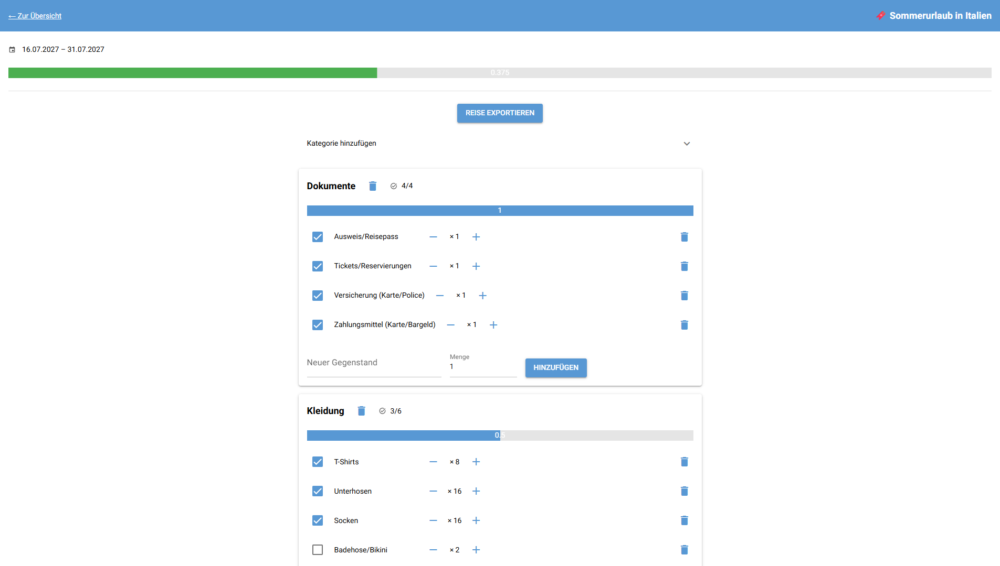

# PackAttack 🧳✈️

**Jeder kennt dieses Problem:** Koffer gepackt, aber dich lässt das Gefühl nicht los, dass du irgendwas vergessen hast. Und sobald du am Ziel angekommen bist, fällt es dir blitzartig wieder ein.

Mit **PackAttack** wollen wir genau das vermeiden. Wir haben eine App programmiert, die Ordnung ins Pack-Chaos bringt – damit Socken und Ladegeräte nie wieder zuhause bleiben müssen.



## 📋 Features

*   ✅ **Reisen verwalten:** Neue Reisen mit Datum und Zielort anlegen.
*   ✅ **Kategorisierung:** Packlisten in Kategorien unterteilen (z. B. Kleidung, Technik, Dokumente).
*   ✅ **Items erfassen:** Beliebig viele Gegenstände pro Kategorie hinzufügen.
*   ✅ **Abhaken:** Interaktive Checkboxen zum "Packen" der Gegenstände.
*   ✅ **Fortschrittsanzeige:** Visueller Balken, wie viel % bereits gepackt sind.
*   ✅ **Vorlagen:** Nutzung von Standard-Listen (z. B. "Strandurlaub") für den Schnellstart.
*   ✅ **Persistenz:** Alle Daten werden in einer SQLite-Datenbank gespeichert.
*   ✅ **Multi-User-Support:** Packlisten können als .json Datei abgespeichert und importiert werden.

## 🛠️ Technologien

*   **Python** (Backend Logik)
*   **NiceGUI** (Web-Framework & UI)
*   **SQLite** (Datenbank)

## 🚀 Installation & Start

Folge diesen Schritten, um die App lokal laufen zu lassen:

1. **Repository klonen**
   ```bash
   git clone https://github.com/Lossophy/Python_Projekt_SWEN.git

   cd Python_Project_SWEN
   ```

2. **Virtuelle Umgebung erstellen & aktivieren**
   ```bash
   # Windows
   python -m venv .venv
   .venv\Scripts\activate

   # Mac/Linux
   python3 -m venv .venv
   source .venv/bin/activate
   ```

3. **Abhängigkeiten installieren**
   ```bash
   pip install -r requirements.txt
   ```

4. **App starten**
   ```bash
   python main.py
   ```
   *Die App sollte nun unter `http://localhost:8080` (oder ähnlich) erreichbar sein. Schaue gegebenenfalls im Terminal nach der richtigen Adresse.*

## 📂 Dateistruktur

```bash
Python_Project_SWEN/
├── assets/          # Bilder etc.
├── Backend/         # Die interne Programmlogik
│   ├── backend.py   # Steuerungslogik und Funktionen
│   └── daten.py     # Definition der Datenklassen/Modelle
├── templates/       # Layout der Seiten
│   ├── base.html    # Grundgerüst für alle Seiten
│   └── ...          # Weitere Templates
├── Draft/           # Entwürfe und temporäre Dateien
├── app.db           # SQLite-Datenbank
├── main.py          # 🚀 Startpunkt der App
├── requirements.txt # Liste aller benötigten Bibliotheken
├── vorlagen.json    # Speichert die Standard-Packlisten
├── setup.cfg        # Config für Code-Qualitätstools (Flake8)
└── README.md        # Diese Dokumentation
```

## 🎯 Anforderungen an die Webapplikation (Referenz)

### Funktionale Anforderungen
| **ID** | **Anforderung** | **Beschreibung** | Status |
| :--- | :--- | :--- | :--- |
| **F1** | Reise anlegen | Benutzer*innen können eine neue Reise mit Name, Reisedatum und Zielort erfassen. | ✅ |
| **F2** | Kategorien erstellen | Es sollen beliebige Kategorien pro Reise definierbar sein (z. B. Kleidung, Technik, Dokumente). | ✅ |
| **F3** | Gegenstände hinzufügen | Zu jeder Kategorie können beliebig viele Gegenstände erfasst werden. | ✅ |
| **F4** | Gegenstände abhaken | Gegenstände können als „gepackt“ markiert werden. | ✅ |
| **F5** | Fortschrittsanzeige | Der Fortschritt (z. B. 12/20 Gegenstände gepackt) wird pro Reise angezeigt. | ✅ |
| **F6** | Listen speichern & laden | Alle Daten werden gespeichert, sodass sie bei erneutem Öffnen wieder verfügbar sind. | ✅ |
| **F7** | Listen löschen | Benutzer*innen können komplette Packlisten oder einzelne Einträge löschen. | ✅ |
| **F8** | Vorlagen verwenden | Es können Standard-Listen als Vorlage genutzt werden (z. B. „Strandurlaub“, „Städtereise“). | ✅ |

### Nicht-funktionale Anforderungen
| **ID** | **Anforderung** | **Beschreibung** |
| :--- | :--- | :--- |
| **NF1** | Benutzerfreundlichkeit | Die Oberfläche soll intuitiv, klar strukturiert und auch für Erstnutzer*innen verständlich sein.  |
| **NF2** | Wartbarkeit            | Der Quellcode soll nach definierten Code Conventions aufgebaut sein und klar dokumentiert werden. |
| **NF3** | Erweiterbarkeit        | Neue Funktionen (z. B. Versand der Liste) sollen leicht ergänzt werden können.    |
| **NF4** | Designfreiheit         | Das Layout ist frei gestaltbar, muss jedoch klar und funktional sein.

---
*Entwickelt mit Python und [NiceGUI](https://nicegui.io).*
